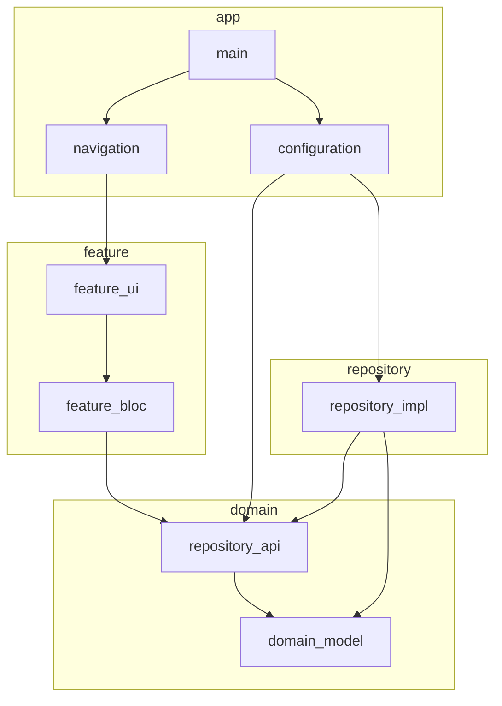
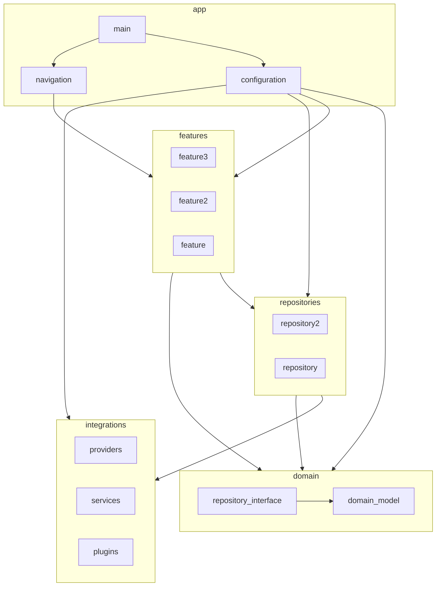

  
    
  
  

reveal.js is an open source HTML presentation framework. It enables anyone with a web browser to create fully featured and beautiful presentations for free. [Check out the live demo](https://revealjs.com/).

The framework comes with a broad range of features including [nested slides](https://revealjs.com/vertical-slides/), [Markdown support](https://revealjs.com/markdown/), [Auto-Animate](https://revealjs.com/auto-animate/), [PDF export](https://revealjs.com/pdf-export/), [speaker notes](https://revealjs.com/speaker-view/), [LaTeX support](https://revealjs.com/math/), [syntax highlighted code](https://revealjs.com/code/) and much more.

<h1>
  <a href="https://revealjs.com/installation" style="font-size: 3em;">Get Started</a>
</h1>

## Documentation
The full reveal.js documentation is available at [revealjs.com](https://revealjs.com).

## Online Editor
Want to create your presentation using a visual editor? Try the official reveal.js presentation platform for free at [Slides.com](https://slides.com). It's made by the same people behind reveal.js.

## License

MIT licensed

Copyright (C) 2011-2020 Hakim El Hattab, https://hakim.se

## x

mermaid diagram

# y 

mermaid diagram

